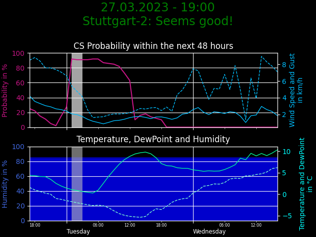

# CS-Warn
### Telegram Bot for Astronomers 

Sends Message with current weather data plot at least at noon. 
Checks several times a day and updates data plot if there are significant changes. 

***under construction ...*** 
